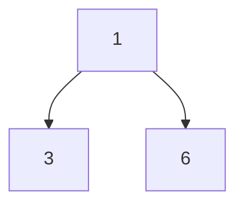
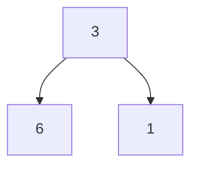
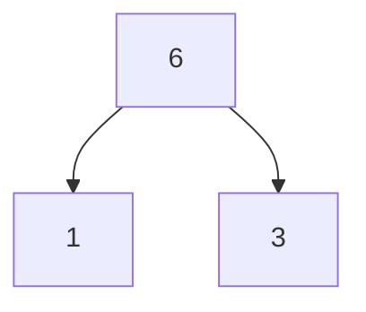
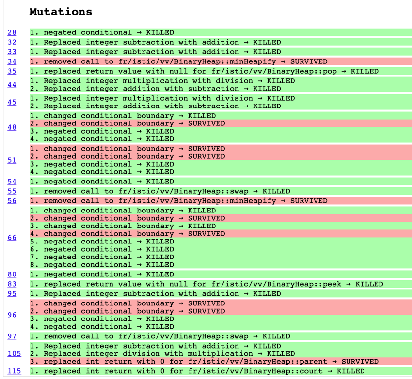
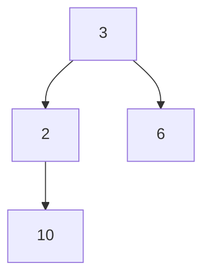
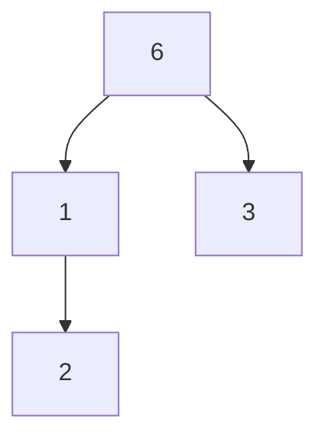

# Implementing and testing a binary heap

A [*binary heap*](https://en.wikipedia.org/wiki/Binary_heap) is a data structure that contains comparable objects and it
is able to efficiently return the lowest element.
This data structure relies on a binary tree to keep the insertion and deletion operations efficient. It is the base of
the [*Heapsort* algorithm](https://en.wikipedia.org/wiki/Heapsort).

Implement a `BinaryHeap` class with the following interface:

```java
class BinaryHeap<T> {

    public BinaryHeap(Comparator<T> comparator) { ...}

    public T pop() { ...}

    public T peek() { ...}

    public void push(T element) { ...}

    public int count() { ...}

}
```

A `BinaryHeap` instance is created using a `Comparator` object that represents the ordering criterion between the
objects in the heap.
`pop` returns and removes the minimum object in the heap. If the heap is empty it throws a `NotSuchElementException`.
`peek` similar to `pop`, returns the minimum object but it does not remove it from the `BinaryHeap`.
`push` adds an element to the `BinaryHeap`.
`count` returns the number of elements in the `BinaryHeap`.

Design and implement a test suite for this `BinaryHeap` class.
Feel free to add any extra method you may need.

Use the following steps to design the test suite:

1. With the help of *Input Space Partitioning* design a set of initial test inputs for each method. Write below the
   characteristics and blocks you identified for each method. Specify which characteristics are common to more than one
   method.
2. Evaluate the statement coverage of the test cases designed in the previous step. If needed, add new test cases to
   increase the coverage. Describe below what you did in this step.
3. If you have in your code any predicate that uses more than two boolean operators check if the test cases written to
   far satisfy *Base Choice Coverage*. If needed add new test cases. Describe below how you evaluated the logic coverage
   and the new test cases you added.
4. Use PIT to evaluate the test suite you have so far. Describe below the mutation score and the live mutants. Add new
   test cases or refactor the existing ones to achieve a high mutation score.

Use the project in [tp3-heap](../code/tp3-heap) to complete this exercise.

## Answer

### 1. Input Space Partitioning

#### pop

| Caractéristique | b1  | b2  | b3  |
|-----------------|-----|-----|-----|
| Taille du tas   | 0   | 1   | \>1 |

#### peek

| Caractéristique | b1  | b2  |
|-----------------|-----|-----|
| Taille du tas   | 0   | 1   |

#### push

| Caractéristique                                                 | b1        | b2         | b3                      |
|-----------------------------------------------------------------|-----------|------------|-------------------------|
| Taille du tas                                                   | 0         | 1          | \>1                     |
| Comparaison avec l'élément minimum et maximum (tas de taille 2) | < minimum | \> maximum | \> minimum && < maximum |

#### swap

| Caractéristique | b1   | b2   |
|-----------------|------|------|
| Taille du tas   | <= 1 | \> 1 |

#### count

| Caractéristique | b1  | b2   |
|-----------------|-----|------|
| Taille du tas   | 0   | \>=1 |

#### minHeapify

| Caractéristique | b1       | b2        |
|-----------------|----------|-----------|
| Taille du tas   | \> index | \>= index |

Pour cette méthode, on va avoir trois configurations d'arbres à tester :

1. L'arbre est correct



2. L'élément de gauche est plus petit



3. L'élément de droite est plus petit



On remarque que la taille du tas est une caractéristique commune à toutes les méthodes.

### 2. Statement Coverage

Avec cette configuration, on obtient une couverture de 100%.

### 3. Base Choice Coverage

On n'a pas plus de 2 opérateurs booléens dans notre code, donc on n'a pas besoin de vérifier le base choice coverage.

### 4. Mutation Score

Avec cette configuration, on obtient un score de 75%.



#### Ligne 34

On remarque qu'on ne teste pas le cas où la méthode `this.minHeapify` est appelée après la suppression du premier
élément de l'arbre.
On ajoute donc un test avec un arbre impossible, mais petit et qui permet de tester ce cas.



Dans ce cas-là, la méthode `minHeapify` est nécessaire pour rétablir l'ordre de l'arbre.
Ce mutant est donc tué.

#### Ligne 66

Deux mutants survivent pour les conditions `i >= this.count()` et `j >= this.count()`
qui deviennent `i > this.count()` et `j > this.count()`.

On remarque que ces deux conditions sont inutiles, car elles sont déjà vérifiées dans les méthodes
`get` et `set` de la classe `ArrayList`.

Cette redondance à créer des mutants équivalents.

On supprime donc ces deux conditions et ces deux mutants n'existent plus.

#### Ligne 105

C'est une fonction privée qui n'est pas testée, on ajoute donc un test pour la couvrir.

#### Ligne 96

Concernant le mutant sur la condition `this.comparator.compare(this.heap.get(parent(index)), this.heap.get(index)) > 0`,
nous avons ici un mutant équivalent car si on la transforme en `>=`, cela inclut les égalités, ce qui ne change pas le
comportement du programme.

Même chose pour la condition `index > 0`.
Si `index = 0` et que la condition est `>=`, `parent(0) = 0` et donc on ne rentre pas dans la boucle car la comparaison
de l'élément avec lui-même n'est pas `> 0`.
Le comportement ne change ainsi pas.

#### Ligne 34

On développe un cas de test ou l'élément en tête d'arbre est plus grand que deux niveaux d'enfants.



Alors, la méthode `minHeapify` doit être appelée récursivement pour rétablir l'ordre de l'arbre.
Le mutant est tué.

#### Ligne 51

Nous avons ici des mutants équivalents qui touchent les
comparaisons `this.comparator.compare(this.heap.get(right), this.heap.get(smallest)) < 0`
et `this.comparator.compare(this.heap.get(left), this.heap.get(smallest)) < 0`.
Si les `<` sont remplacés par des `<=`, cela inclut les égalités, ce qui ne change pas le comportement du programme.
