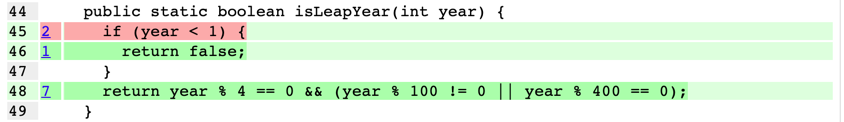

# Test the Date class

Implement a class `Date` with the interface shown below:

```java
class Date implements Comparable<Date> {

  public Date(int day, int month, int year) { ...}

  public static boolean isValidDate(int day, int month, int year) { ...}

  public static boolean isLeapYear(int year) { ...}

  public Date nextDate() { ...}

  public Date previousDate

  { ...}

  public int compareTo(Date other) { ...}

}
```

The constructor throws an exception if the three given integers do not form a valid date.

`isValidDate` returns `true` if the three integers form a valid year, otherwise `false`.

`isLeapYear` says if the given integer is a leap year.

`nextDate` returns a new `Date` instance representing the date of the following day.

`previousDate` returns a new `Date` instance representing the date of the previous day.

`compareTo` follows the `Comparable` convention:

* `date.compareTo(other)` returns a positive integer if `date` is posterior to `other`
* `date.compareTo(other)` returns a negative integer if `date` is anterior to `other`
* `date.compareTo(other)` returns `0` if `date` and `other` represent the same date.
* the method throws a `NullPointerException` if `other` is `null`

Design and implement a test suite for this `Date` class.
You may use the test cases discussed in classes as a starting point.
Also, feel free to add any extra method you may need to the `Date` class.

Use the following steps to design the test suite:

1. With the help of *Input Space Partitioning* design a set of initial test inputs for each method. Write below the
   characteristics and blocks you identified for each method. Specify which characteristics are common to more than one
   method.
2. Evaluate the statement coverage of the test cases designed in the previous step. If needed, add new test cases to
   increase the coverage. Describe below what you did in this step.
3. If you have in your code any predicate that uses more than two boolean operators check if the test cases written to
   far satisfy *Base Choice Coverage*. If needed add new test cases. Describe below how you evaluated the logic coverage
   and the new test cases you added.
4. Use PIT to evaluate the test suite you have so far. Describe below the mutation score and the live mutants. Add new
   test cases or refactor the existing ones to achieve a high mutation score.

Use the project in [tp3-date](../code/tp3-date) to complete this exercise.

## Answer

### 1. Input Space Partitioning

#### isValidDate

Cette méthode prend en paramètre trois entiers qui représentent le jour, le mois et l'année et retourne un booléen qui
indique si la date est valide ou non.

Les caractéristiques de cette méthode sont les suivantes :

| Caractéristique                                              | b1     | b2             |
|--------------------------------------------------------------|--------|----------------|
| Jour en février dans une année bissextile                    | 1-29   | ]-∞;1[∪]29;+∞[ |
| Jour en février dans une année non bissextile                | 1-28   | ]-∞;1[∪]28;+∞[ |
| Jour en avril, juin, septembre et novembre                   | 1-30   | ]-∞;1[∪]30;+∞[ |
| Jour en janvier, mars, mai, juillet, août, octobre, décembre | 1-31   | ]-∞;1[∪]31;+∞[ |
| Mois                                                         | 1-12   | ]-∞;1[∪]12;+∞[ |
| Année                                                        | [1;+∞[ | ]-∞;1[         |

#### isLeapYear

Cette méthode prend en paramètre un entier qui représente l'année et retourne un booléen qui indique si l'année est
bissextile ou non.

Les caractéristiques de cette méthode sont les suivantes :

| Caractéristique  | b1     | b2     |
|------------------|--------|--------|
| Année bissextile | oui    | non    |
| Année            | [1;+∞[ | ]-∞;1[ |

#### nextDate

Cette méthode prend en paramètre une date et retourne une nouvelle date qui correspond à la date du jour suivant.

Les caractéristiques de cette méthode sont les suivantes :

| Caractéristique                                              | b1             | b2     | b3  |
|--------------------------------------------------------------|----------------|--------|-----|
| Jour en février dans une année bissextile                    | ]-∞;1[∪]29;+∞[ | 1-28   | 29  |
| Jour en février dans une année non bissextile                | ]-∞;1[∪]28;+∞[ | 1-27   | 28  |
| Jour en avril, juin, septembre et novembre                   | ]-∞;1[∪]30;+∞[ | 1-29   | 30  |
| Jour en janvier, mars, mai, juillet, août, octobre, décembre | ]-∞;1[∪]31;+∞[ | 1-30   | 31  |
| Mois                                                         | ]-∞;1[∪]12;+∞[ | 1-11   | 12  |
| Année                                                        | ]-∞;1[         | [1;+∞[ |     |

#### previousDate

Cette méthode prend en paramètre une date et retourne une nouvelle date qui correspond à la date du jour précédent.

Les caractéristiques de cette méthode sont les suivantes :

| Caractéristique                                              | b1             | b2   | b3     |
|--------------------------------------------------------------|----------------|------|--------|
| Jour en février dans une année bissextile                    | ]-∞;1[∪]29;+∞[ | 2-29 | 1      |
| Jour en février dans une année non bissextile                | ]-∞;1[∪]28;+∞[ | 2-28 | 1      |
| Jour en avril, juin, septembre et novembre                   | ]-∞;1[∪]30;+∞[ | 2-30 | 1      |
| Jour en janvier, mars, mai, juillet, août, octobre, décembre | ]-∞;1[∪]31;+∞[ | 2-31 | 1      |
| Mois                                                         | ]-∞;1[∪]12;+∞[ | 2-12 | 1      |
| Année                                                        | ]-∞;1[         | 1    | ]1;+∞[ |

#### compareTo

Cette méthode prend en paramètre une date et retourne un entier qui indique si la date est antérieure, égale ou
postérieure à la date passée en paramètre.

Les caractéristiques de cette méthode sont les suivantes :

| Caractéristique                                         | b1         | b2    | b3         |
|---------------------------------------------------------|------------|-------|------------|
| Relation de la date passée en paramètre avec notre date | supérieure | égale | inférieure |
| Date passée en paramètre est null                       | oui        | non   |            |

### 2. Logic Coverage

Avec les tests suivants, on obtient une couverture de 96%.
On peut voir que c'est la fonction `compareTo` que nous n'avons pas assez testé.
On ajoute un cas où l'année est différente et un cas où le mois est différent.
Avec ces deux cas, on obtient une couverture de 100%.

### 3. Base Choice Coverage

Ligne 37, dans la fonction `isValidDate`, nous avons la
condition `(year < 1 || month < 1 || month > 12 || day < 1 || day > 31)`.

| Cas de test numéro | `year < 1` | `month < 1` | `month > 12` | `day < 1` | `day > 31` | Résultat |
|--------------------|------------|-------------|--------------|-----------|------------|----------|
| 1                  | F          | F           | F            | F         | F          | F        |
| 2                  | F          | F           | F            | F         | V          | V        |
| 3                  | F          | F           | F            | V         | F          | V        |
| 4                  | F          | F           | F            | V         | V          | V        |
| 5                  | F          | F           | V            | F         | F          | V        |
| 6                  | F          | F           | V            | F         | V          | V        |
| 7                  | F          | F           | V            | V         | F          | V        |
| 8                  | F          | F           | V            | V         | V          | V        |
| 9                  | F          | V           | F            | F         | F          | V        |
| 10                 | F          | V           | F            | F         | V          | V        |
| 11                 | F          | V           | F            | V         | F          | V        |
| 12                 | F          | V           | F            | V         | V          | V        |
| 13                 | F          | V           | V            | F         | F          | V        |
| 14                 | F          | V           | V            | F         | V          | V        |
| 15                 | F          | V           | V            | V         | F          | V        |
| 16                 | F          | V           | V            | V         | V          | V        |
| 17                 | V          | F           | F            | F         | F          | V        |
| 18                 | V          | F           | F            | F         | V          | V        |
| 19                 | V          | F           | F            | V         | F          | V        |
| 20                 | V          | F           | F            | V         | V          | V        |
| 21                 | V          | F           | V            | F         | F          | V        |
| 22                 | V          | F           | V            | F         | V          | V        |
| 23                 | V          | F           | V            | V         | F          | V        |
| 24                 | V          | F           | V            | V         | V          | V        |
| 25                 | V          | V           | F            | F         | F          | V        |
| 26                 | V          | V           | F            | F         | V          | V        |
| 27                 | V          | V           | F            | V         | F          | V        |
| 28                 | V          | V           | F            | V         | V          | V        |
| 29                 | V          | V           | V            | F         | F          | V        |
| 30                 | V          | V           | V            | F         | V          | V        |
| 31                 | V          | V           | V            | V         | F          | V        |
| 32                 | V          | V           | V            | V         | V          | V        |

Il nous faut trouver au moins 6 (n + 1) cas de tests pour couvrir toutes les branches en sachant que chaque opération
booléenne doit être évaluée une fois à `true` et une fois à `false` tout en
ayant une influence sur le résultat final. Aussi, les deux cas couvrant une opération booléenne doivent avoir pour
différence uniquement la valeur de l'opération booléenne.
On choisit donc les cas de tests 1, 2, 3, 5, 9 et 17.

On dispose déjà de tests couvrant le cas 1 (date valide), 2 et 3 (jour invalide), 9 (mois invalide) et 17 (année
invalide).

On ajoute donc les cas de tests 9 qui teste un mois supérieur à 12.

---
Maintenant pour la condition `year % 4 == 0 && (year % 100 != 0 || year % 400 == 0)`.

| Cas de test numéro | `year % 4 == 0` | `year % 100 != 0` | `year % 400 == 0` | Résultat |
|--------------------|-----------------|-------------------|-------------------|----------|
| 1                  | F               | F                 | F                 | F        |
| 2                  | F               | F                 | V                 | F        |
| 3                  | F               | V                 | F                 | F        |
| 4                  | F               | V                 | V                 | F        |
| 5                  | V               | F                 | F                 | F        |
| 6                  | V               | F                 | V                 | V        |
| 7                  | V               | V                 | F                 | V        |
| 8                  | V               | V                 | V                 | V        |

On choisit les cas de tests (5, 6) pour la dernière condition, (6, 2) pour la première condition et (7, 5) pour la
deuxième condition.
On a donc les cas de tests 2, 5, 6 et 7.

- Il est impossible de couvrir le cas 2, car on ne peut pas avoir `year % 4 != 0` et `year % 400 == 0` en même temps (
  400 est divisible par 4).
- 2100 est une année divisible par 4 et 100, mais pas par 400, elle couvre le cas 5 (on ajoute ce test)
- 2000 est une année divisible par 4, 100 et 400, elle couvre le cas 6 (on ajoute ce test)
- 2004 est une année divisible par 4, mais pas par 100 et 400, elle couvre le cas 7 (on ajoute ce test)

### 4. Mutation Testing

En l'état, on obtient un score de 91% de mutation. Analysons les mutations qui n'ont pas été tuées.


Ligne 27 de l'image ci-dessus, on a une mutation qui remplace la première comparaison par un `<=`.
En effet, on ne teste pas le cas où une année est égale à 1. Après avoir ajouté ce cas, le mutant est tué.



Même chose ligne 45. La comparaison est remplacée par un `<=`.
On ne teste pas le cas où l'année est égale à 1. Mais on a affaire à un mutant équivalent.
Effectivement, l'année 1 n'est pas bissextile, la fonction renvoie donc `false`, la fonction d'origine et la fonction
mutante renvoient la même valeur.

On peut tout de même tuer ce mutant en modifiant la condition en remplaçant `year < 1` par `year <= 0`.


Ligne 70, c'est aussi une comparaison qui est remplacée par un `<=`.
On ne teste pas le cas où le jour est égal à 2 (`previousDay = day - 1`).
Après avoir ajouté ce cas, le mutant est tué.

Pour finir, nous obtenons un score de 100% de mutation.